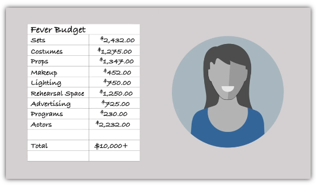
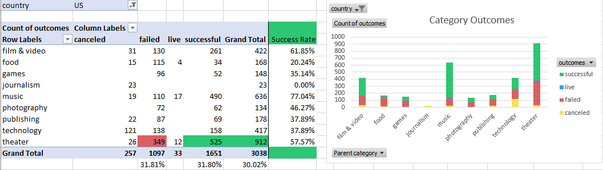

                                                                                Michelle Werner (4/10/2022)
# Kickstarting with Excel: An Analysis of Kickstarter Campaigns 
---

## Overview of Project

For this project, the client Louise is planning on launching a kickstarter campaign to fund the production of her play, "Fever". She has a $10K budget and has asked for help in determining best practices for a successful campaign - which will hopefully aid in her fundraising efforts and conclude with the successful funding of her play. 

Pictured: Louise's Budget

### Purpose

With an in-depth analysis of global kickstarter campaign data, I hope to generate recommendations that will help the client make decisions about how to manage both her campaign and plan her kickstarter goals and launch  from an informed viewpoint. The analytics provided in this report should make it possible for my client to leverage analysis insights to improve the probability of a successesful campaign and ensure its meeting - and hopefully surpassing - fundraising goals. 

## Analysis and Challenges

For this analysis, data sorting began with adding conditional visuals to the outcomes column, designating successful campaigns (campaigns that reached their goal and were funded) in green, unsucessful campaigns in red, campaigns that are still ongoing (live) in blue, and canceled campaigns in yellow. This is visible in the column labeled "Outcomes" of the main "Kickstarter" worksheet. 

By adding a pivot table and with these four outcomes as columns, the view of the data is further simplified and highlights the fact that, in the US, the category of "theater" (the category our client's kickstarter falls into, with subcategory "play") typcially has one of the highest success rates with this type of fundraising - coming in at #3 under films & music if we tally the score by percentage rate, and 1st in sheer volumes.

Figure 1: Outcomes for US Kickstarters by Category

In the figure above, the stacked columns chart on the right illustrates the volume of kickstarters in each category in the US.  On the left, we see the data that produced this chart, but also see the percentage rates (for this initial review, only counts and percentages were used; more sophisticated statistical analysis could also be performed if the client is interested in a higher level of accuracy in trend forecasting).

By performing the same comparisons on the "subcategory" of "plays", t

Figure 1: Outcomes for US Kickstarters by Subategory

By calculating "Percentage Funded" and the "Average Funded" (in additional data columns), it is possible to chart the outcomes based on month to identify trends in launch date to better understand how these dates might coorelate with campaign success.

### Analysis of Outcomes Based on Launch Date

By charting outcomes on a line chart with markers based on launch date, we see that the month that lauched the most successful Kickstarter campaigns was May (234/2185). Also illustrated is that failed kickstarters have occured at similarly high rates in January, June, July and October (all near 150/1500).

### Analysis of Outcomes Based on Goals

### Challenges and Difficulties Encountered

## Results

- What are two conclusions you can draw about the Outcomes based on Launch Date?

- What can you conclude about the Outcomes based on Goals?

- What are some limitations of this dataset?

- What are some other possible tables and/or graphs that we could create?

Performing analysis on kickstarter data to uncover trends for hypothetical analysis project for Louise, a playwrite who wants to do a kickstarter campaign to fund her play, "FEVER"

We looked at global kickstarter data and narrowed it to comparative campaigns (i.e. theatrical works, plays, and musicals) in the US  - and Britian where some of Louise's favorites have been successfully funded.

Louise's budget was $10K but that is more funding than most have been able to acquire.  Analysis indicates she should keep her kickstarter at a lower goal. 

Also, it appears the best month to launch would be May.

---
### NOTE: This exercise continues in the Module 1 Challenge, so please refer to the more complete analysis there...
:)

Editing final readme  
