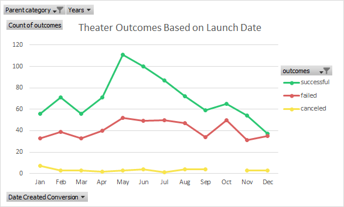

                                                                                           Michelle Werner (4/10/2022)
# Kickstarting with Excel: An Analysis of Kickstarter Campaigns 
---

## Overview of Project

For this project, the client Louise is planning on launching a kickstarter campaign to fund the production of her play, "Fever". She has a $10K budget and has asked for help in determining best practices for a successful campaign - which will hopefully aid in her fundraising efforts and conclude with the successful funding of her play. 

Pictured: Louise's Budget

### Purpose

With an in-depth analysis of global kickstarter campaign data, I hope to generate recommendations that will help the client make decisions about how to manage both her campaign and plan her kickstarter goals and launch  from an informed viewpoint. The analytics provided in this report should make it possible for my client to leverage analysis insights to improve the probability of a successesful campaign and ensure its meeting - and hopefully surpassing - fundraising goals. 

## Analysis and Challenges

For this analysis, data sorting began with adding conditional visuals to the outcomes column, designating successful campaigns (campaigns that reached their goal and were funded) in green, unsucessful campaigns in red, campaigns that are still ongoing (live) in blue, and canceled campaigns in yellow. This is visible in the column labeled "Outcomes" of the main "Kickstarter" worksheet. 

By adding a pivot table and with these four outcomes as columns, the view of the data is further simplified and highlights the fact that, in the US, the category of "theater" (the category our client's kickstarter falls into, with subcategory "play") has one of the highest success rates with this type of fundraising.

Figure 1: Outcomes for US Kickstarters by Category

In the figure above, the chart of stacked columns on the right illustrates the volume of kickstarters in each category in the US. On the left, we see the data that produced this chart, but also see the percentage rates.  The category of "theater" has the third highest success rate, with films & music holding first and second place. "Theater" is highest in successful campaign volume. (For this initial review, only counts and percentages were used, but more sophisticated statistical analysis could also be performed and would likely yield a higher level of accuracy in trend forecasting.)

Figure 2: Outcomes for US Kickstarters by Subategory

In figure 2, we see clearly the volume of "plays" successfully funded via this kickstarter method. Louise is on the right track!

### Analysis of Outcomes Based on Launch Date

Figure 3: Outcomes for US "Theater" Kickstarters by Launch Date

By charting outcomes on a line chart with markers based on launch date, we see that the month that lauched the most successful Kickstarter campaigns was May. Also illustrated is that failed kickstarters have occured at similarly high rates in January, June, July and October.  If possible, Louise should launch her campaign in may.

### Analyis of Funding IQRs

Figure 4: Funding IQRs

Looking at funding, most failed kickstarter campaigns have had higher funding goals. Louise is asking for more than twice the average successful kickstarter goal.  In order for her to have the best chance of success, Louise might consider lowering her fundraising goal on this platform.

### Analysis of Outcomes Based on Goals

Figure 5: Outcomes vs. Goals

By calculating "Percentage Funded" and the "Average Funded" (in additional data columns), it is possible to chart the outcomes based on month to identify trends in launch date to better understand how these dates might coorelate with campaign success. In the chart above "Outcomes vs. Goals", it is not clear what is actually going on, except that there may be many unknown reasons why campaigns fail.

### Challenges and Difficulties Encountered
---
## Results

#### Outcomes Based on Launch Date Conclusions:

Louise would do well to launch her kickstarter campaign in May. May has the highest success rate of any month accouding to the data analyized.  Louise should aim to completely avoid launching in December or January.

#### Outcomes based on Goals Conclusions:

Louise should try to get her play produced for less money - OR simply run her kickstarter fundraiser for at a lower campaign rater - and find a supplemental source of funding (or perhaps lauch a second campaign later).
